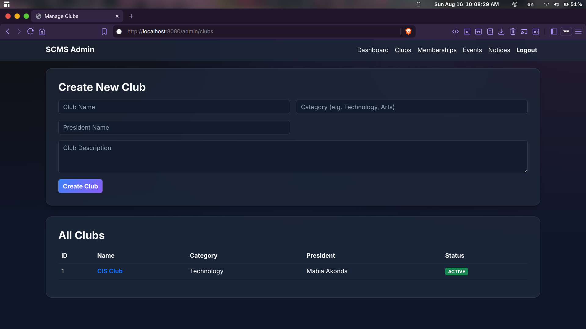
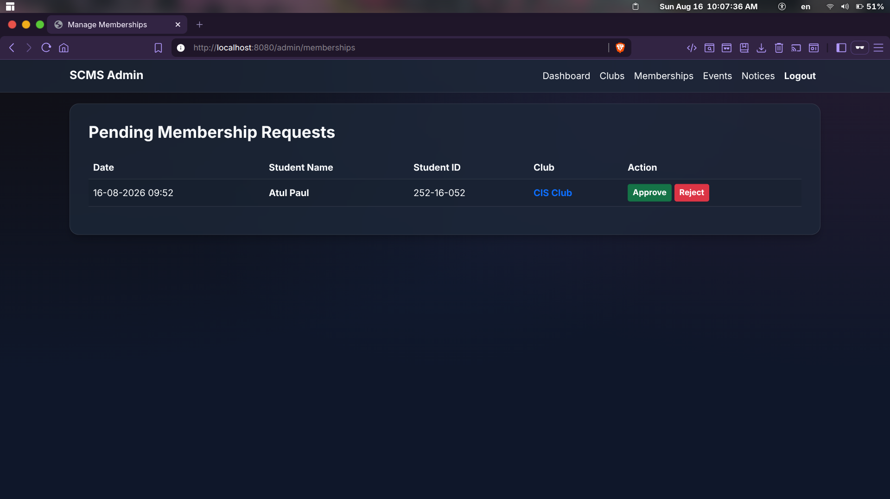
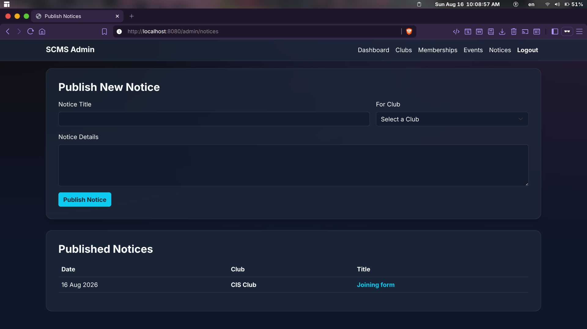

# 🎓 Student Club Management System (SCMS)

A modern, web-based platform built with **Java OOP**, **Spring Boot**, and **Thymeleaf** for managing student clubs, events, and memberships in an educational institution. 

This is designed as an Object-Oriented Programming (OOP) Semester Project, emphasizing clear architecture, polymorphism, inheritance, and clean code principles.

---

## 🌟 Key Features

### 🧑‍🎓 Student Portal
- **Discover Clubs**: View a list of all active clubs and read their details.
- **Membership Management**: Apply for memberships and see the real-time status of your requests (Pending/Approved/Rejected).
- **Club Inner Portal**: Once approved, access exclusive club events and notices.
- **Event Registration**: Register for upcoming club events.

### 🛡️ Admin Portal
- **Manage Clubs**: Create and oversee all clubs on campus.
- **Manage Memberships**: Approve or reject student membership applications.
- **Manage Events & Notices**: Publish announcements and schedule events for specific clubs.
- **Role-based Dashboards**: Distinct views and capabilities based on user roles.

---

## 📸 Screenshots

Here are some glimpses of the system in action:

### 1. Club Management


### 2. Membership Requests


### 3. Notices & Announcements


---

## 🛠️ Technology Stack
- **Backend:** Java 21, Spring Boot 3.3.x, Spring Data JPA
- **Frontend:** Thymeleaf, HTML5, CSS3 (Glassmorphism UI), Bootstrap 5
- **Database:** H2 Database (File-based for easy portability without installation)
- **Security:** jBCrypt for password hashing

---

## 🚀 How to Run the Project

1. **Prerequisites:** Make sure you have **Java 21** installed on your system.
2. **Clone the Repository:**
   ```bash
   git clone https://github.com/atul-dev-ai/OOP_Semester_Project.git
   cd OOP_Semester_Project/project
   ```
3. **Run the Application:**
   Use the provided Maven wrapper to run the project without installing Maven globally:
   ```bash
   ./mvnw spring-boot:run
   ```
4. **Access the System:**
   Open your browser and navigate to: `http://localhost:8080/login`

---

## 🔑 Default Credentials

Upon the first run, the system automatically seeds a default Admin account:
- **Email:** `admin@scms.edu`
- **Password:** `admin123`

---

## 🧬 OOP Concepts Demonstrated
- **Encapsulation:** Entities and models hide internal states and expose standard getters/setters.
- **Inheritance:** `Admin` and `Student` classes inherit from a base `User` class.
- **Polymorphism:** The `User` class declares an abstract method `displayDashboard()` which is overridden uniquely by both `Admin` and `Student` to redirect to their respective portals.
- **Abstraction:** Use of Service Interfaces and Repositories to abstract database operations.

---
*Built with ❤️ for the OOP Semester Project.*
